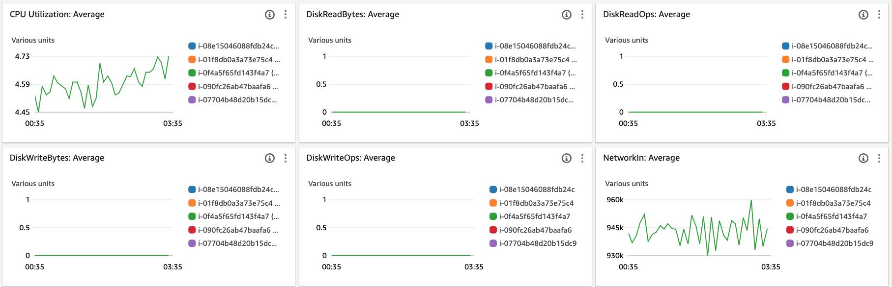
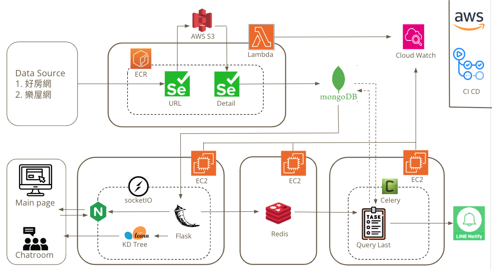

# Roommate Matching and Renting Website

This is a renting webiste which uses AI model match roommates. It also provide real-time notification about latest suitable houses for users. 

Website : https://rentright.info/login

Test account :
* Username : Ray
* Email : ray67672@gmail.com
* password : 12345678

## Table of Content
- [Data Collection](#data-collection)
  - [Extract](#extract)
  - [Transform](#transform)
  - [Load](#load)
- [Website Features](#website-feature)
  - [Search](#search)
  - [Tracking System](#tracking-system)
  - [Recommend Houses](#recommend-houses)
  - [Chatroom](#chatroom)
  - [Line Notification](#line-notification)
  - [Other Features](#other-features)
- [Monitoring (CloudWatch)](#monitoring-cloudwatch)
- [Architecture](#architecture)
- [Video](#demo-video)

## Data Collection 
* Extract
    * Use **Selenium** as a Web Crawler tool to get data from “好房網” “樂租網”
    * Put Selenium into AWS **lambda** which has event trigger and time schedule function
    * Use **S3** to store rent house URL and house detail information as backup

* Transform
    * Houses data will be transformed into vector by **one-hot encoding**, and filter irrelevant content

* Load
    * Load in **MongoDB Atlas**

## Website Feature 

* Search
    * Filters to search houses such as “Budget”, “House Age”, “Zone”, “Park”
    * User Profile
    * User basic information such as “Job”, “Gender”, “Introduction”
    * User daily routine such as “Sleep time”, “Hygiene Tolerance”, “Noise Tolerance”
    * Each user’s information will be transformed by one-hot encoding

* Tracking System
    * Track users’ saved and clicked houses
    * Track users’ number of friends and cancelled count
    * Above condition will be calculated as “active_status”

* Recommend Houses
    * Use KDTree to recommend similar houses base on user click
    * Base on information by track system to recommend customized houses "AI GO"

    https://github.com/Ray-red-byte/Appworks_Personal/assets/72739609/05ced9b5-2c36-4c0a-9d1d-e287a13e7c90

* Chatroom
    * Use **KDTree** model to find matched roommates
    * Match priority will be ranked by user’s active_status
    * Use **socketIO** to allow users communicate with each other

    https://github.com/Ray-red-byte/Appworks_Personal/assets/72739609/5315d624-7327-44e2-983e-ccc8bab81c00
    

    https://github.com/Ray-red-byte/Appworks_Personal/assets/72739609/2d1217b2-f54b-420c-bb6d-e4bb4daf464c

* Line Notification
    * Send notification task through **Redis** served as a queue to organize tasks
    * Use **Celery** framework to run in background to get up-to-date houses from MongoDB, which can offload backend server
    * Use **Line Notify API** to send customized houses

* Other 
    * Use **Cloudwatch** Check EC2 CPU utilization and Memory usage as well as lambda health status
    * Use **Github Action** to auto deploy code to EC2
    * Use **NGINX** Load balance and reverse proxy

## Monitor (CloudWatch)
* EC2 Alarm
    * If EC2 CPU and Memory exceed certain threshold then I will receive email
* Lambda alarm
    * If invocation is less than 1 within 30 minutes then I will reseive email
* Login alarm
    * If login error occur more than 5 within 30 seconds then I will receive email

## Architecture

## Demo Video
[Demo Link](https://youtu.be/IXN778xn8X8)

